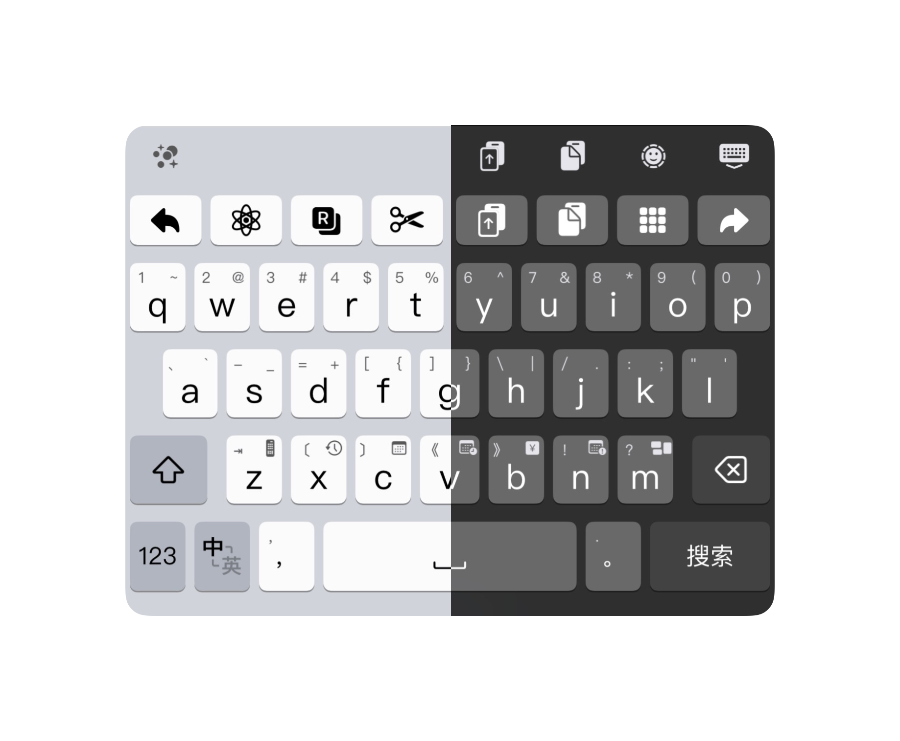
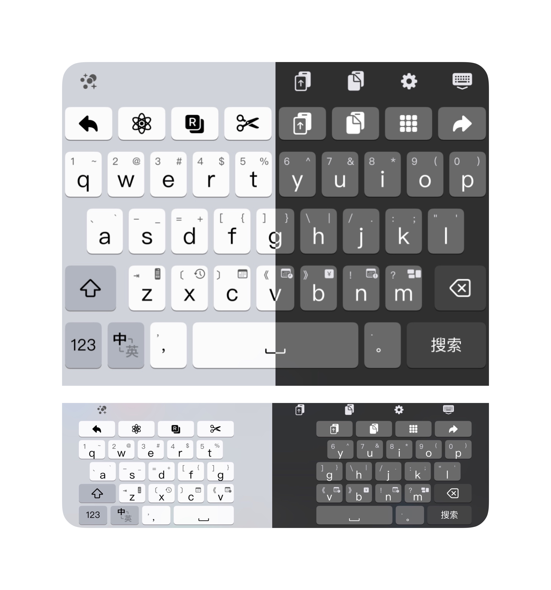
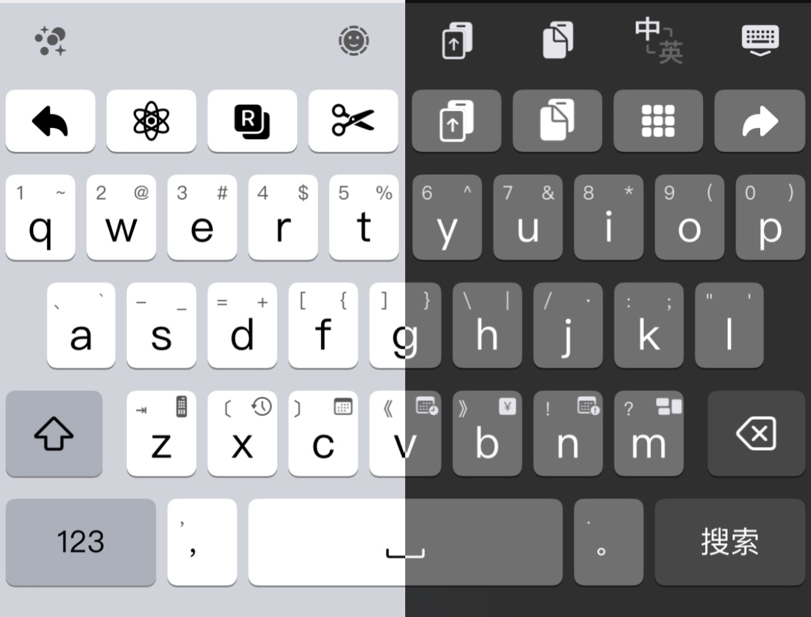

# 使用说明
## 雾凇拼音
- ~~`26_Normal_New.hskin`可用于关闭app中的划动分页功能，且中英切换键为键盘按键并非功能区按键（推荐）~~
- ~~`26_Normal_Final.hskin`在`New`基础上更新，增加app搜索功能，调整键盘高度更适合关闭内嵌模式使用（推荐）~~
- `26_Normal.hskin`与`Final`基本一致，调整空格等按键宽度（推荐）
- ~~`26_Normal_Default.hskin`或`26_Normal.hskin`可用于关闭app中的划动分页功能（推荐）~~
- ~~`26_Normal_Default下划分页.hskin`或`26_Normal下划分页.hskin`可用于开启app的划动分页功能（停止更新，暂不推荐使用）~~

## 万象拼音PRO
- `26_Normal_wwxx.hskin`

## 输入法案
- 雾凇拼音的小鹤双拼（部分功能需要自定义，如x按键下滑为历史上屏，需要自行添加相关lua脚本等）
- 万象拼音PRO也是用小鹤双拼+墨奇辅助
## 功能按键说明
最上一排为功能键，依次为：
1. 左移，点击左移，长按移动到行首（万象皮肤长按为重复动作，左移，上划为移动到行首），预输入行为为上屏第一个字，如输入“nihc“，则上屏ni对应的字
2. 脚本，单击呼出脚本菜单，长按第一个选项为翻译脚本，需自行添加名为”Translator“的脚本，长按第二个选项跳转至app的剪切板页面
3. app按键，点击跳转app，长按分别为Google搜索、在Safari打开链接、在App Store搜索
4. 剪切按键
5. 复制按键
6. 粘贴按键，点击粘贴，长按分别为呼出收藏短语、剪切板界面
7. 全选按键，长按第一个选项为撤销，第二个选项为重做
8. 右移，效果同左移

## 其他按键说明：
- shift：
    - 雾凇：右划为tab，上划`引导拆字，下划；引导小鹤音形辅码（需自行配置），预输入为分词
    - 万象：右划为tab，上划上屏提示内容；预输入点击为"/"引导辅码组合
- z：下划为=号引导计算器功能，上划为tab
- x：历史上屏，需自行配置，其他均为雾凇拼音自带功能
- c：orq引导的日期功能
- v：datetime引导的时间功能
- b：R引导的金额查询功能
- n：N引导的日期查询功能
- m：uU引导的拆字查询功能
- delete：左划为删除预输入且未上屏的所有内容，上划为删除所有上屏内容

- 123：右划选择方案，上划方案选单，长按第一个选项为表情键盘，第二个为符号键盘，第三个为功能选单，第四个为输入方案选单
- 中英切换键盘按键：
    - 雾凇拼音：长按第一个选项为简繁切换，第二个为输入预测开关（均需配合Input_Method中的雾凇拼音方案使用使用）
    - 万象拼音：长按第一个选项为简繁切换，第二个为中英翻译切换开关，第三个为墨奇拆分切换开关（均需配合Input_Method中的万象拼音PRO方案使用使用），第四个为提示器开关，第五个为预测开关
- 中文逗号：上划输入英文逗号，预输入状态为向前翻页按钮（需在app中关闭划动分页功能），长按可持续输入中文逗号或者连续翻页
- 空格：上划次选，下划3选，预输入显示comment等内容
- 中文句号：上划输入英文句号，预输入状态为向后翻页按钮（需在app中关闭划动分页功能），长按可持续输入中文句号或者连续翻页

**推荐使用皮肤功能**

## 键盘外观
### ~~`26_Normal_New.hskin`外观~~

### `26_Normal_Final.hskin`或`26_Normal_WX.hskin`外观 （**推荐**）

### ~~`26_Normal_Default.hskin`或`26_Normal.hskin`外观~~

## 脚本说明
26个按键的上下划动和长按、功能按键的长按均可通过Python脚本快捷修改，请将文件解压缩后进行操作