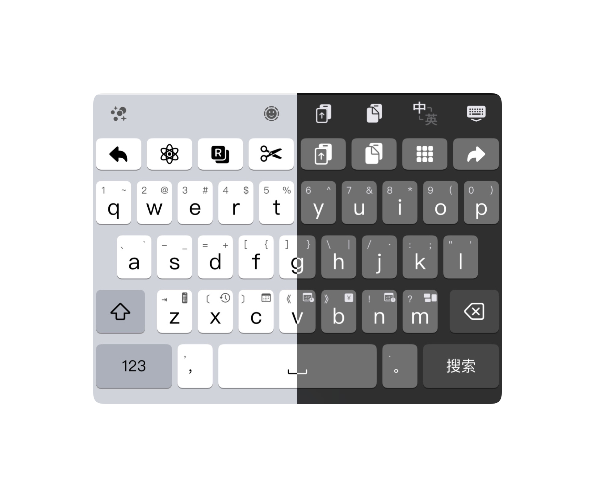

# 使用说明

请和[自定义配置](../Input_Method/万象拼音/Rime4Hamster/)一起使用，尤其是自定义按键部分

## 万象拼音PRO
- `26键-万象.hskin`（对应release中`26-wanxiang.hskin`）： 普通皮肤
- `26键-万象-动画.hskin`（对应release中`26-wanxiang-animation.hskin`）：普通皮肤基础上增加按键动画
- `26键-万象-声音.hskin`（对应release中`26-wanxiang-sound.hskin`）：普通皮肤基础上增加按键动画和声音

## 输入法案
- 万象拼音PRO
## 功能按键说明
最上一排为功能键，依次为：
1. 左移，点击左移；长按为重复动作，左移；上划为移动到行首；下划为以词定字（如输入“nihc“，则上屏ni对应的字）；预输入点击为向前切换所选的候选词；
2. 脚本，单击呼出脚本菜单；长按分别为Google搜索、在Safari打开链接、在App Store搜索；预输入为声调一声。预输入为候选词列表向上翻页。
3. 点击执行翻译脚本（需配置名为Translator的脚本）。
4. 剪切按键；预输入为声调二声。
5. 复制按键；预输入为声调三声。
6. 粘贴按键，点击粘贴，长按分别为呼出收藏短语、剪切板界面；预输入为声调四声。
7. 全选按键，长按第一个选项为撤销，第二个选项为重做；预输入为向后切换所选的候选词。
8. 右移，效果同左移

## 其他按键说明：
- shift：右划为`\`引导的预输入符号，下划上屏tips内容，上划为"'"引导三码辅助合并；预输入点击为"/"引导四码辅码合并
- z：下划为`V`引导计算器功能，上划为tab
- x：下划为`onl`引导的农历日期
- c：下划为`orq`引导的日期功能
- v：下划为`datetime`引导的时间功能
- b：下划为`R`引导的金额查询功能
- n：下划为`N`引导的日期查询功能
- m：单次下划为拆字查询或笔画查询功能，两次下划为​造词
- delete：左划为删除预输入且未上屏的所有内容，上划为删除所有上屏内容

- 123：右划选择方案，上划方案选单，长按第一个选项为表情键盘，第二个为符号键盘，第三个为功能选单，第四个为输入方案选单
- 中英切换键盘按键：长按第一个选项为简繁港台切换，第二个为中英翻译切换开关，第三个为拆分切换开关（均需配合Input_Method中的万象拼音PRO方案使用使用），第四个为提示器开关，第五个为预测开关
- 中文逗号：上划输入英文逗号，长按可持续输入中文逗号；~~预输入功能为`\`引导的预输入符号~~
- 空格：上划次选，下划3选，预输入显示comment等内容
- 中文句号：上划输入英文句号，长按可持续输入中文句号；预输入显示为tips的类型，按下为上屏预输入

**推荐使用皮肤功能**

## 键盘外观

## 脚本说明
26个按键的上下划动和长按、功能按键的长按均可通过[Python脚本](../Python_Tools/)快捷修改，请将文件解压缩后进行操作